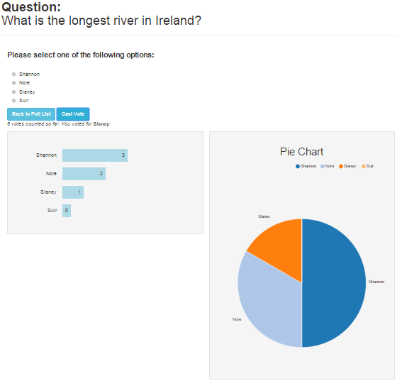

## ECMAScript 6 Real Time Voting App

This application allows you to submit a question along with a number of multiple choice answers that you would like feedback on. Whoever browses to the App URL and selects the poll can vote (i.e. select one of the possible answers). The votes are shown graphically on a bar chart and an NVD3 pie-chart. The charts update in real time whenever a vote is cast.

## Inspiration

This App is based on a polling App created by [Joe Lennon](https://github.com/joelennon/bluemixpolls).
Joe's App has an accompanying IBM developerWorks article [Build a real-time polls application with Node.js, Express, AngularJS, and MongoDB](http://www.ibm.com/developerworks/library/wa-nodejs-polling-app/).
Joe's license is included with the code. The front end looks mostly the same as Joes. 

## ECMAScript 6 (ES6)

It should be good practice to begin coding Angular Apps using ECMAScript6 (ES6) features that Angular 2.0 will be using. Thanks to Transpilers like Traceur it is possible to write ES6 App's now. This App uses the following ES6 features.

- ES6 modules (will eventually replace angular modules)
- ES6 classes (to store controller and factory code)

The App uses the Gulp build tool.
Using the gulp-traceur module to compile ES6 code to ES5.
The ES5 code is then piped into the Build directory 

Note: _gulp unit:tdd_ turns on the Karma test runner. 
However I have not got Karma working properly with ES6.
My karma setup is based on [Googles ATScript Playground Repo](https://github.com/angular/atscript-playground)

## Main Technologies Used

- [NodeJS](http://nodejs.org/)
- [ExpressJS](http://expressjs.com/) 
- [AngularJS](https://angularjs.org/)
- [Socket.io](socket.io)
- [SocketIO](http://socket.io/)
- [BT Ford's socket.io Angular Module](https://github.com/btford/angular-socket-io)
- [Bootstrap3](http://getbootstrap.com/)
- [MongoDB](http://www.mongodb.org/)
- [Mongoose](http://mongoosejs.com/)
- [NVD3](http://nvd3.org/)
- [angular-NVD3-directives](https://github.com/angularjs-nvd3-directives/angularjs-nvd3-directives)
- [Traceur ECMAScript 6 to ECMAScript 5 Transpiler](https://github.com/google/traceur-compiler)
- [D3](http://d3js.org/)
- [gulp](http://gulpjs.com/)
- [gulp-traceur](https://www.npmjs.com/package/gulp-traceur)

## Running the App

- clone the repository
- npm install
- bower install
- Also inside public directory do npm install 
- run MongoDB
- gulp
- browse to http://localhost:3000/

If having issues do:
- gulp clean
- gulp

## Screen Shots

		

Michael Cullen  
2015

